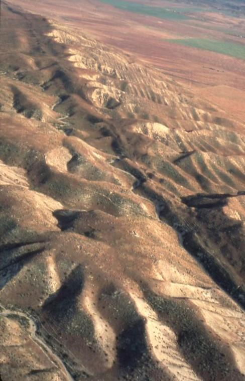

# leaflet-challenge {Geo-Mapping with Leaflet.JS}

---
## Background & Challenge
The USGS is responsible for providing scientific data about natural hazards, the health of our ecosystems and environment; and the impacts of climate and land-use change. Their scientists develop new methods and tools to supply timely, relevant, and useful information about the Earth and its processes. 

The USGS is interested in building a new set of tools that will allow them visualize their earthquake data. They collect a massive amount of data from all over the world each day, but they lack a meaningful way of displaying it. Their hope is that being able to visualize their data will allow them to better educate the public and other government organizations (and hopefully secure more funding..) on issues facing our planet.

---
## Dashboard Development Toolkit

>* JavaScript
>* d3.js
>* Leaflet.js
>* GitBash
>* HTML
>* CSS
>* USGS GeoJson API
---
## Operating Instructions
1. Clone repository to desired location while maintaining directory paths. 

2. **Local Server** *Recommended* : Open reposity with VS Code, and initialize a local server from the index.html file using the [LiveServer](https://marketplace.visualstudio.com/items?itemName=ritwickdey.LiveServer) extension.

3. **Local Server** *Python* : Open GitBash from cloned repository directory location and enter the following to initialize a local server:

>`python -m http.server`

4. **Local Server** *Python* : Using your browser, navigate to the initialized server at **localhost:8000**, and this will serve the application without CORS issues.

---
## Application Screenshots
